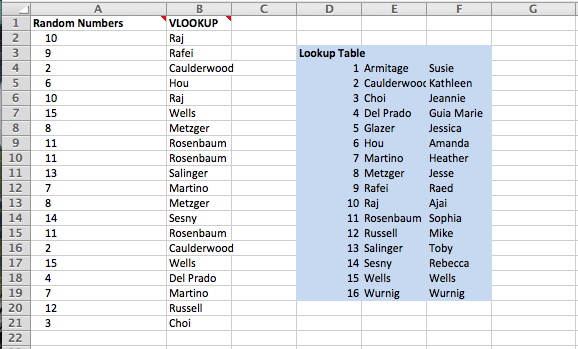

# Vlookup

It isn't at all uncommon to find yourself with a table full of data, [Complaints to the DOB](http://www.nyc.gov/html/dob/html/codes_and_reference_materials/foilmonthly.shtml#complaint) (also available on [NYC Open Data](https://data.cityofnewyork.us/Housing-Development/DOB-Complaints-Received/eabe-havv)), say, but the most interesting thing in the data is the "Complaint Category", which is stored as numeric codes. 

And the codes are defined in a whole [separate table](http://www.nyc.gov/html/dob/downloads/pdf/complaint_category.pdf).

You know you can use [tabula](../lecture_notes/tabula.md) to copy that table into a spreadsheet. 

## Easy Lookup
I started out with a simple table: Column A is numers I'd like to look up (I actualy generated them with `=RANDBETWEEN(1,16)`, but in the realworld you'd have some codes that you know you want to be able to lookup.

Over in the range `D4:F19` I have my lookup table. It's blue because I formatted it. There's nothing special about those cells otherwise. 

And in Col B I have my function: `=VLOOKUP(A2,D$4:F$19,2)`

The first argument (`A2`) tells us that the value we want to know more about is in cell A2. The second argument says that the table we're going to look for that value in is `D$4:F$19` --the `$` ensures that when I pull this function down, to fill cells below, the table won't also increment. Even when I'm looking for `A10`, I always want to look in `D4:F19`. The last value `2` says that the Value I want back is in column 2 of the lookup table. I could lookup first names instead with `=VLOOKUP(A2,D$4:F$19,3)` -- see if you can figure out why that works. 

## Challenge
You can write references between spreadsheets but they're fussy. Save yourself a headache by adding your lookup table as a separate tab on your spreadsheet. And name it. 

And then write a `=vlookup()` that matches complaints to building codes. 